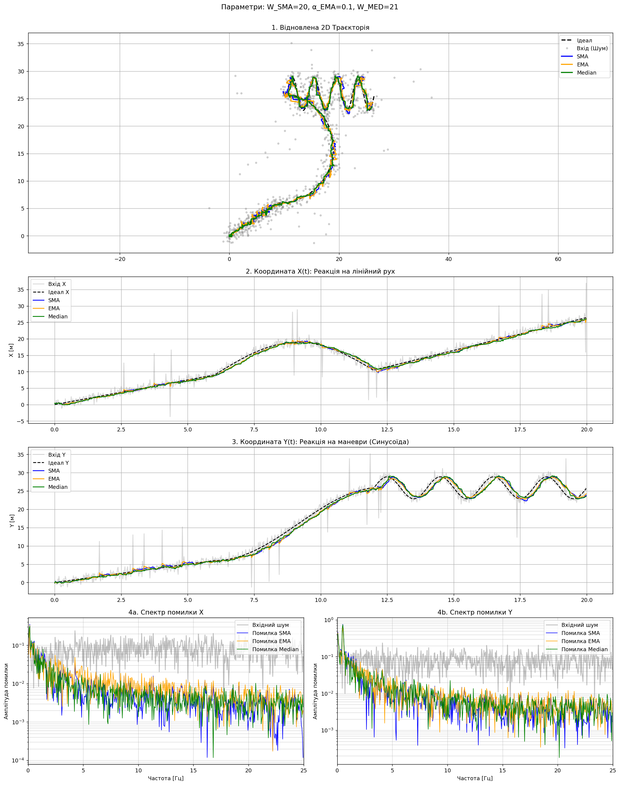
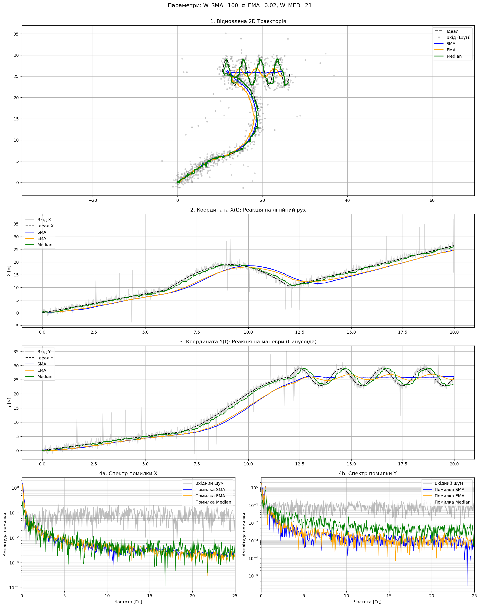
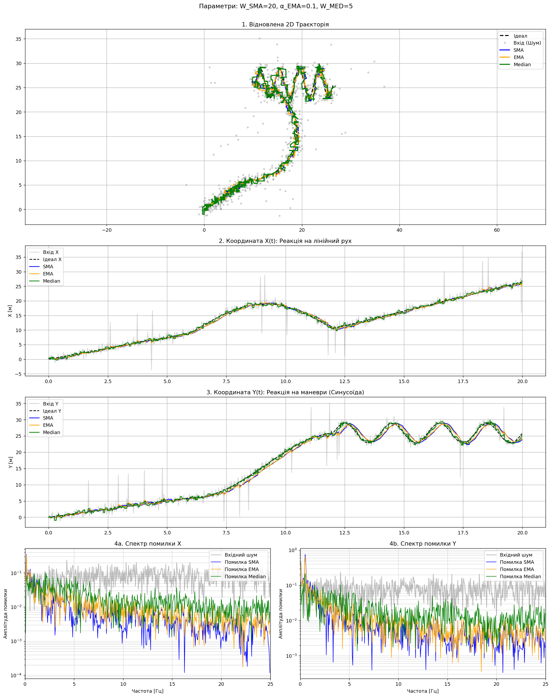

# Лабораторна робота №5: Обробка координатних даних: Придушення шумів у потоці (Real-time)

**Автор:** Деніел Мартін (ІПЗ-4.01)

---

## Реалізація

Було реалізовано три класи цифрових фільтрів. Кожен з них обробляє точки **по одній**, імітуючи роботу в реальному часі — без доступу до «майбутніх» даних.

### SMAFilter — Просте ковзне середнє

```python
class SMAFilter:
    def __init__(self, w):
        self.w = w
        self.q = deque(maxlen=w)
        self.sum = 0.0

    def update(self, x):
        if len(self.q) == self.w:
            self.sum -= self.q[0]   # Відніміть старий елемент
        self.q.append(x)
        self.sum += x
        return self.sum / len(self.q)
```

Реалізація оптимізована до **O(1)** — замість повного перерахунку на кожному кроці, підтримується поточна сума: зі старим елементом, що виходить з вікна, від суми відраховується його значення, а нове — додається.

### EMAFilter — Експоненційне ковзне середнє

```python
class EMAFilter:
    def __init__(self, alpha):
        self.a = alpha
        self.last = None

    def update(self, x):
        if self.last is None:
            self.last = x
        else:
            self.last = self.a * x + (1 - self.a) * self.last
        return self.last
```

При першому виклику фільтр ініціалізується поточним значенням. Далі — рекурсивне зважування: нові значення впливають із вагою `α`, а минулий стан — із вагою `1 - α`.

### MedianFilter — Медіанний фільтр

```python
class MedianFilter:
    def __init__(self, w):
        if w % 2 == 0:
            w += 1
        self.w = w
        self.q = deque(maxlen=w)

    def update(self, x):
        self.q.append(x)
        return np.median(self.q)
```

Нелінійний фільтр: зберігає вікно останніх `W` точок і повертає їх медіану. Автоматично коригує парне вікно на непарне.

---

## Експеримент 1 — Базовий (Baseline)

**Параметри:** `W_SMA = 20`, `α_EMA = 0.1`, `W_MED = 21`



### Аналіз

**Графік 3 (Y), ділянка 13–20 с («змійка»):**
Усі три фільтри помітно відстають від ідеальної траєкторії (чорний пунктир) — особливо в піках синусоїди. Це очікувана поведінка: фільтри з великим вікном «інертні» і не встигають за різкими змінами напрямку. EMA реагує трохи швидше за SMA завдяки рекурсивній природі, проте також демонструє lag.

**Медіанний фільтр проти викидів:**
Медіанний фільтр (зелена лінія) значно краще справляється з поодинокими різкими викидами (сірі точки, що стирчать далеко від траєкторії). Це його ключова перевага: одиничний викид просто стає «крайнім значенням» у відсортованому вікні і не впливає на медіану. SMA, натомість, «розмазує» кожен викид на ціле вікно — результат: помітна хвиля на синій лінії після кожного стрибка.

---

## Експеримент 2 — Екстремальне згладжування (Over-smoothing)

**Параметри:** `W_SMA = 100`, `α_EMA = 0.02`, `W_MED = 21`



### Аналіз та пояснення парадоксу

**Графік 4b (Спектр помилки Y), зона 0–1 Гц (низькі частоти):**
При збільшенні вікна кольорові лінії помилки **піднялися вище** за сіру лінію вхідного шуму. Це означає, що фільтр вніс **більше спотворень**, ніж містив сам сигнал до фільтрації.

**Чому так відбувається — парадокс over-smoothing:**
Фільтр з великою «пам'яттю» (W = 100 = 2 секунди) реагує на зміну траєкторії із затримкою ~1 секунда. Під час синусоїдального руху («змійка») фільтр продовжує «пам'ятати» попередній напрямок і систематично зрізає кути кожного повороту. Ця систематична помилка є детермінованою і повільно змінюється — тобто вона зосереджена саме на **низьких частотах**. В результаті на спектрі помилки зліва утворюється виразний «горб»: фільтр прибрав високочастотний шум, але натомість створив низькочастотне спотворення самої траєкторії, яке є більшим за початковий шум.

---

## Експеримент 3 — Мале вікно медіанного фільтра

**Параметри:** `W_SMA = 20`, `α_EMA = 0.1`, `W_MED = 5`



### Аналіз

**Широкі викиди (кілька точок підряд):**
При `W_MED = 5` медіанний фільтр **не справляється** з «широкими» викидами, що тривають 3 і більше точок поспіль. Якщо більше половини вікна заповнені аномальними значеннями — медіана сама стає аномальною. З великим вікном (`W_MED = 21`) ця проблема зникає, бо поодинокі викиди залишаються меншістю.

**Гладкість Median vs SMA при малому вікні:**
При порівнянному вікні (≈5 точок) лінія SMA є більш плавною на ділянках без викидів, оскільки усереднює всі значення. Медіана — «жорсткіша»: вона вибирає одне конкретне значення з вікна, тому може давати легку «сходинковість» на плавних ділянках. Проте на ділянках з викидами медіана явно виграє.

---

## Висновок

| Задача | Найкращий фільтр | Обґрунтування |
|---|---|---|
| Видалення одиничних збоїв сенсора (викидів) | **Median** | Єдиний нелінійний фільтр, що повністю ігнорує outliers; вони просто не потрапляють у вибіркову медіану |
| Плавне ведення траєкторії (мінімальна затримка) | **EMA** | Рекурсивна природа дозволяє реагувати швидше за SMA при тому ж рівні згладжування; потребує мінімум пам'яті |

На практиці оптимальним є **комбінований підхід**: спочатку медіанний фільтр для усунення викидів, потім EMA для плавності траєкторії.
